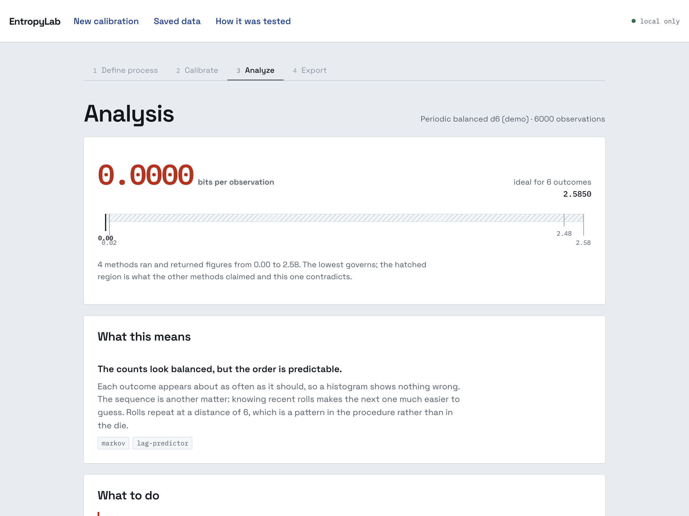
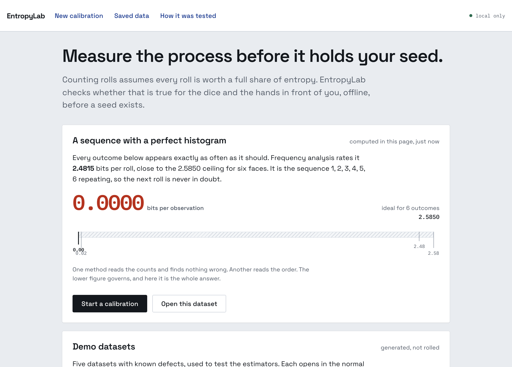

# EntropyLab

Offline profiling for physical Bitcoin entropy processes before they are trusted with a seed.

## What it is

EntropyLab measures bias and sequential predictability in dice, coin flips, and other discrete
physical sources, estimates a conservative min-entropy lower bound using four independent
estimators, and reports which one is limiting.

EntropyLab profiles the entropy-generation **process**. It does not:

- generate a production Bitcoin seed
- request a mnemonic
- request private keys
- upload calibration observations
- claim to certify true randomness

## Demo

The demo video is not recorded yet. The route it follows is written up in
[docs/DEMO.md](./docs/DEMO.md), and everything in it runs from the application today.

A hosted build is configured but has not published yet. The link goes here once a deployment has
actually succeeded.

Until then, [run it locally](#run-the-application). It takes two commands.

## Why it exists

Self-custody guides tell people to roll dice, then stop there. The usual check is counting rolls,
which assumes every roll carries full entropy.

Here is what that check misses. These are five d6 datasets from this repository, scored by the
frequency analysis most people apply:

| Dataset                                     | Most-common-value estimate |
| ------------------------------------------- | -------------------------- |
| Fair-like control                           | 2.3983                     |
| **Perfectly balanced, fully deterministic** | **2.4815**                 |

The second dataset is `0,1,2,3,4,5` repeating. Every roll is knowable in advance. Frequency
analysis rates it **above** the genuinely random control, because its histogram is exactly uniform
while a real random draw carries sampling noise.

Run the sequential estimators over the same data and it reports **0.0000 bits per symbol**.

A process can be perfect under the check most people apply and worthless in fact.



## Current status

The analysis engine and the application are both working. No real dice have been rolled into it
yet.

| Component                                    | State                                                                       |
| -------------------------------------------- | --------------------------------------------------------------------------- |
| Core data model and validation               | Implemented                                                                 |
| Most-common-value estimator                  | Implemented, matches NIST reference to 10 decimals                          |
| Collision estimator                          | Implemented, matches NIST reference to 10 decimals                          |
| Markov estimator                             | Implemented as a documented generalisation, not comparable to the reference |
| Lag predictor                                | Implemented, matches NIST reference to 10 decimals                          |
| Conservative combination and target guidance | Implemented                                                                 |
| JSON and Markdown reports                    | Implemented                                                                 |
| Adversarial fixtures and proof campaign      | Implemented                                                                 |
| Reference comparison against NIST tooling    | Implemented                                                                 |
| Offline web application                      | Implemented                                                                 |
| Explanation and guidance layer               | Implemented                                                                 |
| Local persistence and report export          | Implemented                                                                 |
| Integrator API and example                   | Implemented                                                                 |
| Privacy audit                                | Implemented                                                                 |
| Static deployment                            | Configured, not yet published                                               |
| Physical dice import pipeline                | Implemented, awaiting real rolls                                            |
| Real physical dice dataset                   | Not collected                                                               |
| Demo video                                   | Not recorded                                                                |

151 unit tests and 22 browser tests pass. CI runs formatting, typecheck, both suites, a build, and
checks that the published campaign results still match a fresh run.

## Results

Estimated min-entropy in bits per symbol, against a 2.5850 ideal for six faces. Generated by
`pnpm campaign`; see [docs/proof-campaign](./docs/proof-campaign/).

| Fixture           | Most common value | Collision | Markov   | Lag predictor | Conservative | Limiting          |
| ----------------- | ----------------- | --------- | -------- | ------------- | ------------ | ----------------- |
| FAIR_LIKE         | 2.3983            | 2.5850    | 2.2154   | 2.4620        | 2.2154       | markov            |
| BIASED            | 1.4055            | 1.5130    | 1.3747   | 2.1733        | 1.3747       | markov            |
| PERIODIC_BALANCED | 2.4815            | 2.5850    | 0.0194   | 0.0000        | 0.0000       | lag-predictor     |
| STICKY_MARKOV     | 2.4232            | 2.5850    | 0.4765   | 0.5533        | 0.4765       | markov            |
| LOW_SAMPLE        | 1.2223            | 1.5538    | declined | declined      | 1.2223       | most-common-value |

Reading the rows:

- **PERIODIC_BALANCED** scores highest of all five under frequency analysis and lowest of all five
  once sequence is considered. A 2.48 bit drop on one dataset.
- **STICKY_MARKOV** is a die that repeats its previous face 60% of the time. Its histogram is
  within 0.06 bits of the fair control. The lag predictor names lag 1 as the winning lag: the die
  is not tumbling between throws.
- **BIASED** is the control for the opposite direction. The defect is in the histogram alone, and
  the lag predictor understates it. Neither family dominates, which is why the pipeline takes the
  minimum across all of them.
- **LOW_SAMPLE** is the same fair process with 40 observations instead of 6000. Two estimators
  decline rather than return a number.

## Verification against NIST tooling

The estimators are compared against the NIST SP 800-90B reference implementation, using a binary
built from NIST's own C++ sources rather than a reimplementation. Every comparable figure agrees to
ten decimal places on every fixture. See
[docs/proof-campaign/reference-comparison.md](./docs/proof-campaign/reference-comparison.md).

This is a methodology check. It is not a validation and confers no certification.

One divergence is deliberate. On the 40-observation fixture the reference lag predictor returns
1.9002 bits per symbol; EntropyLab declines. The reference tool is built for validation datasets of
at least a million samples, where the question never arises. A dice ceremony never reaches that
size, so the applicability gate has to be explicit.

## Real physical campaign

Every dataset above is a **synthetic adversarial fixture**: generated from a seeded PRNG with a
defect deliberately injected, to test the estimators against defects whose answers are known in
advance. None of them has touched a die, and none is evidence about any real die.

Campaign F is the one campaign that uses real observations: three sessions of 256 hand-recorded d6
rolls, 768 total, labelled a **physical calibration sample** wherever it appears.

The protocol is fixed in advance, in [docs/CAMPAIGN-F-PROTOCOL.md](./docs/CAMPAIGN-F-PROTOCOL.md),
including the invalid-roll rule and the reason per-session and combined results are reported
separately. Writing the rules before seeing the data is the point: a re-roll rule invented after a
surprising streak is not a rule.

Raw observations are never edited, cleaned, or normalised. If the die turns out to be measurably
biased, that is the result.

**Status: awaiting recorded sessions.** `data/physical` contains no observations, and
`pnpm campaign:physical` writes nothing until real session files exist. There is no synthetic
fallback for this campaign.

## Run the application

Requires Node 20 or later and pnpm.

```bash
pnpm install
pnpm --filter @entropylab/web dev     # http://localhost:5173
```

Open it, pick a demo dataset, and the analysis runs in the page. Turn your network off and it keeps
working; there is a browser test that asserts exactly that.



## Run the checks

```bash
pnpm test        # 147 unit tests
pnpm test:e2e    # 17 browser tests, builds the app first
pnpm typecheck
pnpm campaign    # regenerates docs/proof-campaign from code
pnpm benchmark   # regenerates docs/BENCHMARKS.md from code
```

Nothing in `docs/proof-campaign` or `docs/BENCHMARKS.md` is written by hand. Regenerate and diff to
check any figure quoted here.

Library use:

```ts
import { analyze } from "@entropylab/core";

const analysis = analyze({ alphabetSize: 6, observations: [0, 3, 5, 1, ...] });

analysis.conservativeBitsPerSymbol;  // lowest applicable estimate
analysis.limitingEstimator;          // which method produced it
analysis.estimators;                 // every result, including ones that declined
analysis.warnings;                   // what the reader needs to know
```

## Methodology

Every estimator's source, assumptions, sample-size constraints, and departures from its source are
documented in [docs/METHODOLOGY.md](./docs/METHODOLOGY.md).

Start with
[Methodology boundaries](./docs/METHODOLOGY.md#methodology-boundaries), which separates what is a
published SP 800-90B algorithm, what this project adapted, which thresholds this project chose, and
where the symbol encoding influences a result. Not every number here carries the same authority,
and that section says which is which.

Two departures are worth knowing before reading any number:

- **Collision and Markov are binary-only in SP 800-90B.** A d6 has to be serialised to three bits
  first, and six faces do not fill a three-bit codeword. A perfectly fair die yields a bitstring
  with a one-rate near 0.389 rather than 0.5, so any figure derived from it measures the die and
  the encoding together. Every such result carries that warning.
- **The Markov estimator is a generalisation, not the published method.** The final specification
  restricts it to binary; this implementation follows the structure of the 2016 second draft, which
  supported alphabets up to 26. It is labelled as such in every result and is excluded from the
  reference comparison because it computes a different quantity.

## Integration

A wallet, signer, or seed tool can profile a user's dice in twelve lines, using the same entry
point the application uses:

```ts
import { analyze, explain } from "@entropylab/core";

const analysis = analyze(
  { alphabetSize: 6, observations: faces.map((face) => face - 1) },
  { targetBits: [128] },
);

analysis.conservativeBitsPerSymbol; // bits per roll, or undefined if nothing could run
analysis.limitingEstimator; // which method governed
analysis.warnings; // what the user has to be told
explain(analysis).recommendationText; // one next step, in plain language
```

`analyze` is synchronous, pure, dependency-free, and does no I/O. Runnable example and the full
guide, including what integrators must not claim, are in
[examples/integrator](./examples/integrator/).

## Performance

The whole pipeline on one machine, generated by `pnpm benchmark`:

| Observations | All four estimators |
| ------------ | ------------------- |
| 1,000        | 0.7 ms              |
| 10,000       | 5.3 ms              |
| 1,000,000    | 520.6 ms            |

A dice ceremony produces hundreds of rolls, so the analysis is under a millisecond and there is no
reason for the work to leave the machine. Full figures and where the time goes are in
[docs/BENCHMARKS.md](./docs/BENCHMARKS.md).

## Offline and privacy guarantees

EntropyLab runs offline. There is no telemetry, no account, no backend, and no upload path.

The analysis core performs no I/O, reads no clock, and uses no randomness, so a report is a pure
function of its input. Reports carry a SHA-256 of the dataset and an algorithm version, so a third
party can re-derive them.

The application makes no request that leaves its own origin, which is asserted by a browser test.
Fonts are committed to this repository and served from the bundle rather than a CDN; the first
build linked Google Fonts and that test caught it. Profiles and sessions are stored in IndexedDB on
the device, and a private-session switch blocks every write.

Every one of these claims was checked against the production build rather than asserted, and the
checks run in CI. The audit table is in [docs/PRIVACY.md](./docs/PRIVACY.md).

Calibration observations are calibration data and must never be reused as seed material. Anything
recorded in a public repository is public permanently.

## Architecture

[docs/ARCHITECTURE.md](./docs/ARCHITECTURE.md) records the TypeScript-first stack decision and the
constraints the core library is held to.

## Limitations

Statistical testing can find structure. It cannot establish its absence.

- These four methods do not exhaust the ways a physical process can be predictable.
- A result at the alphabet ceiling means nothing was found, not that the source is strong.
- SP 800-90B assumes around 10^6 samples. No dice ceremony reaches that, so every figure here is
  computed well below the sample size these methods were designed around.
- A calibration sample describes what was observed, not what the process will do next.
- Entropy quality is one part of seed security, and says nothing about the wallet, the derivation,
  the operating system, or who is watching the ceremony.

## BOSS Battle 2026

- Track: Cypherpunk
- Official problem: Physical Entropy Profiler
- Build status: analysis engine and offline application complete; real dice campaign pending
- Developed in public throughout the hack window

## Team

Built by [winsznx](https://github.com/winsznx) for BOSS Battle 2026.

## License

MIT. See [LICENSE](LICENSE).
